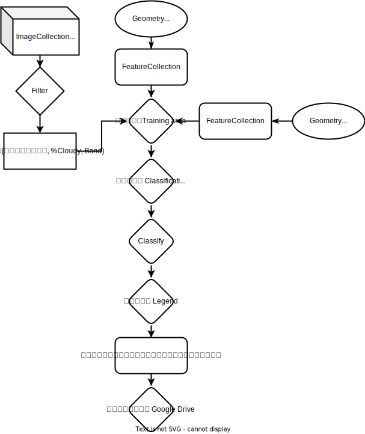
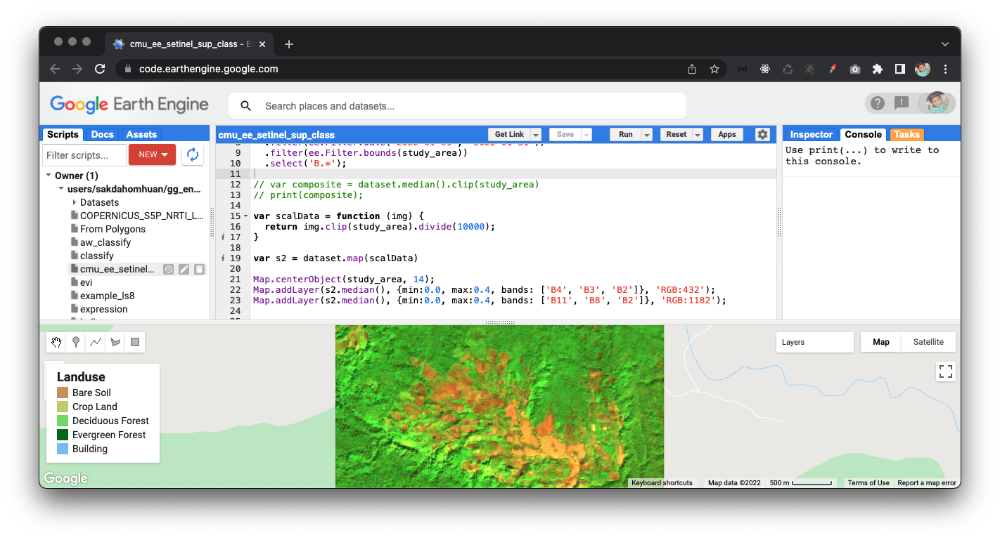
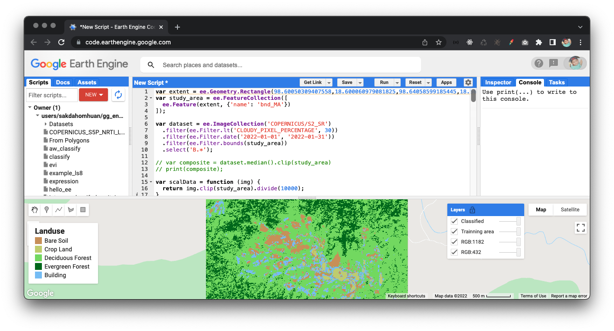

### Table of content
* [การเข้าใช้งาน](./README.md)
* [Client vs. Server](./0_client_vs_server.md)
* [การเขียน JavaScriptเบื้องต้น สำหรับ Earth Engine](./1_JavaScript.md)
* [การใช้ Earth Engine เบื้องต้น](./2_GEE_basic.md)
* [ตัวอย่าง การจำแนกข้อมูลภาพ (Classification)](./3_Classification.md)
* [ตัวอย่าง export ไปใน google drive](./4_export.md)
* [ตัวอย่าง การสร้าง UI](./5_ui.md)

## ตัวอย่าง การจำแนกข้อมูลภาพ (Classification) 
ตัวอย่างนี้เป็นการจำแนกข้อมูลของดาวเทียม Sentinel 2 แบบ Supervised classification ด้วยวิธี Random Forest และ Support Vector Machine โดยมีขั้นตอนดังนี้





กำหนด extent ของพื้นที่ศึกษา
```js
var extent = ee.Geometry.Rectangle(98.60050309407558,18.600060979081825,98.64058599185445,18.568655533373086);
```
สร้าง FeatureCollection จาก Geometry
```js
var study_area = ee.FeatureCollection([
  ee.Feature(extent, {'name': 'bnd_MA'})
]);
```
สร้าง dataset ของภาพที่ต้องการนำมาใช้
```js
var dataset = ee.ImageCollection('COPERNICUS/S2_SR')
```
เลือกข้อมูลจากการปกคลุมของเมฆ
```js
  .filter(ee.Filter.lt('CLOUDY_PIXEL_PERCENTAGE', 30))
```
เลือกวันที่ของข้อมูลที่ต้อง
```js
  .filter(ee.Filter.date('2022-01-01', '2022-01-31'))
```
เลือกขอบเขตของข้อมูลจาก FeatureCollection ของพื้นที่ศึกษา 
```js
  .filter(ee.Filter.bounds(study_area))
```
เลือก band ของข้อมูลภาพที่ต้องการใช้งาน
```js  
  .select('B.*')
```
สร้างฟังก์ชันตัดข้อมูลตามขนาดของพื้นที่ศึกษาและ scale ข้อมูลจาก int to float
```js
var scalData = function (img) {
  return img.clip(study_area).divide(10000);
}
```
เรีกฟังก์ชัน scalData
```js
var s2 = dataset.map(scalData)
```
กำหนดตำแหน่งการแสดงผล
```js
Map.centerObject(study_area, 14);
```
แสดงผลโดยการผสมแบบ true color composite และ false color composite
```js
Map.addLayer(s2.median(), {min:0.0, max:0.4, bands: ['B4', 'B3', 'B2']}, 'RGB:432');  
Map.addLayer(s2.median(), {min:0.0, max:0.4, bands: ['B11', 'B8', 'B2']}, 'RGB:1182');
```
ผลการทำงาน

สร้าง Training area เพื่อเก็บข้อมูลให้เครื่องฝึกเรียนรู้ แบบ Rectangle
```js
var bareSoil = ee.Geometry.Rectangle(98.62616882242132,18.58225882687881,98.6265443316834,18.581953741275164);
var cropLand = ee.Geometry.Rectangle(98.62591102622285, 18.58020150995087, 98.62627580664888, 18.579876081359373);
var forest1 = ee.Geometry.Rectangle(98.62741594658405,18.58581682027496,98.62795238838703,18.585267677260802);
var forest2 = ee.Geometry.Rectangle(98.63757900964077,18.579358673749272,98.63837294350918,18.578545097082692);
var building = ee.Geometry.Rectangle(98.6232372413925,18.583705967136666,98.62355374205626,18.583156817320013); 
var building2 = ee.Geometry.Rectangle(98.62373812203315,18.585700781799776,98.62391514782813,18.585522818858564);
```
สร้าง FeatureCollection ของ Training area โดยกำหนดเป็น class แบบต่าง ๆ
```js
var roi = ee.FeatureCollection([
  ee.Feature(bareSoil, {'class': 1}),  
  ee.Feature(cropLand, {'class': 2}),  
  ee.Feature(forest2, {'class': 3}),  
  ee.Feature(forest1, {'class': 4}),  
  ee.Feature(building, {'class': 5}), 
]);
```
สร้าง label ของ class
```js
var names = ['Bare Soil','Crop Land','Deciduous Forest','Evergreen Forest','Building'];
```
แสดง Training area
```js
Map.addLayer(roi,{color:'red', fillColor:'00000000'},"Trainning area");
```
สร้างตัวแปร array เพื่อกำหนด band สำหรับใช้ classify
```js
var bands = ['B2', 'B8', 'B11'];
```
สรา้งตัวแปร trainning เพื่อให้เครื่องเรียนรู้ตัวอย่างข้อมูลจาก training area
```js
var training = composite.sampleRegions({
  collection: roi, 
  properties: ['class'], 
  scale: 30
});
```
เลือกวิธีการสำหรับ classify ข้อมูล แบบ [Random Forest classifier](https://developers.google.com/earth-engine/apidocs/ee-classifier-smilerandomforest) และระบุพารามิเตอร์ที่จำเป็นลงไป
```js
var smileRandomForest = ee.Classifier.smileRandomForest({
  numberOfTrees : 100
});
```
เลือกวิธีการสำหรับ classify ข้อมูล แบบ [Support Vector Machine](https://developers.google.com/earth-engine/apidocs/ee-classifier-libsvm) และระบุพารามิเตอร์ที่จำเป็นลงไป
```js
var libsvm = ee.Classifier.libsvm({
  kernelType: 'RBF',
  gamma: 0.5,
  cost: 10
});
```    
ฝึกให้เครื่องเรียนรู้ด้วยเมธอด train()
```js
var trained = smileRandomForest.train(training, 'class', bands);
```
จำแนกข้อมูลด้วยเมธอด classify()
```js
var classified = composite.classify(trained);
```

กำหนดค่าสีเพื่อใช้ในการแสดงผลค่าที่ classify ได้
```js
var palette = ['#c9995c', '#c7d270', '#8add60', '#097210', '#8bc4f9'];
```
แสดงผลค่าที่ classify ได้
```js
Map.addLayer(classified, {min: 1, max: 5, palette: palette}, 'Classified'); 
```
สร้าง legend panel
```js
var legend = ui.Panel({
  style: {
    position: 'bottom-left',
    padding: '8px 15px'
  }
});
```
กำหนด legend title
```js
var legendTitle = ui.Label({
  value: 'Landuse',
  style: {
    fontWeight: 'bold',
    fontSize: '18px',
    margin: '0 0 4px 0',
    padding: '0'
    }
});
```
ใส่ title ไปใน panel
```js
legend.add(legendTitle);
```
สร้าง template ของ legend item
```js
var makeRow = function(color, name) {
      var colorBox = ui.Label({
        style: {
          backgroundColor: color,
          padding: '8px',
          margin: '0 0 4px 0'
        }
      });

      var description = ui.Label({
        value: name,
        style: {margin: '0 0 4px 6px'}
      });

      return ui.Panel({
        widgets: [colorBox, description],
        layout: ui.Panel.Layout.Flow('horizontal')
      });
};
```
เพิ่มข้อมูลเข้าไปยัง legend panel
```js
var items = [1,2,3,4,5];
for(var i in items) {
  legend.add(makeRow(palette[i], names[i]));
}  
``` 
เพิ่ม legend เข้าไปยังแผนที่
```js
Map.add(legend);
```
ส่งข้อมูลไปยัง google drive
```js
Export.image.toDrive({
  image: classified,
  description: 'classify_MA',
  folder: 'GEE_data',
  region: study_area,
  scale: 12.5,
  crs: 'EPSG:32647'
});
```
ผลการทำงาน


ลิ้งค์ดูผลการทำงานที่ [https://code.earthengine.google.com/3fc1b468753afad9a474a6ca1a9c73ae](https://code.earthengine.google.com/3fc1b468753afad9a474a6ca1a9c73ae)

