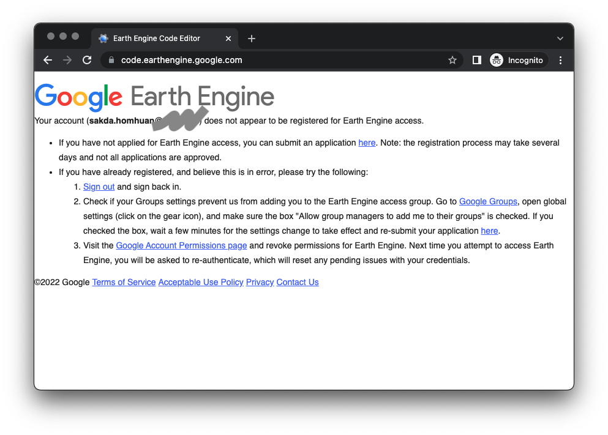
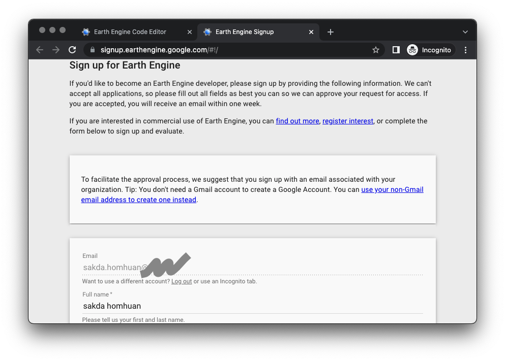

### Table of content
* [การเข้าใช้งาน](#การเข้าใช้งาน)
* [การเขียน JavaScriptเบื้องต้น สำหรับ Earth Engine](./1_JavaScript.md)
* [การใช้ Earth Engine เบื้องต้น](./2_GEE_basic.md)
* [ตัวอย่าง การจำแนกข้อมูลภาพ (Classification)](./3_Classification.md)

# การใช้งาน google earth engine
Earth Engine เป็นระบบบริการข้อมูลและเครื่องมือประมวลผลข้อมูลภูมิสารสนเทศ (geospatial processing service) บนระบบคลาวด์ที่พัฒนาโดย google เป็นคลังข้อมูลจากการสำรวจระยะไกลหลายเพตะไบต์และชุดเครื่องมือที่ใช้ประมวลผลข้อมูลเชิงพื้นที่ที่หลากหลาย
เราสามารถเขียนชุดคำสั่งเพื่อวิเคราะห์ข้อมูลเชิงพื้นที่ขนาดใหญ่ เอื้อให้นักวิทยาศาสตร์ นักวิจัย และนักพัฒนาสามารถใช้ Earth Engine เพื่อตรวจจับการเปลี่ยนแปลง 
วิเคราะห์ข้อมูลเชิงปริมาณด้านต่างๆ ของพื้นผิวโลก Earth Engine เปิดให้ใช้งานในเชิงพาณิชย์แล้ว แต่ยังคงให้บริการฟรีสำหรับการใช้งานด้านวิชาการและการวิจัย

### การเข้าใช้งาน
Earth Engine สามารถเลือกใช้แบบภาษา Python หรือ JavaScript ซึ่งการทำงานแบบ JavaScript จะมี Code Editor ที่สามารถทำงานแบบ web-based บน browser เช่น google chrome 
โดยเข้าใช้งานได้ที่ [https://code.earthengine.google.com/](https://code.earthengine.google.com/) สำหรับผู้ที่เข้าใช้งานเป็นครั้งแรกต้องลงทะเบียนเพื่อขอเข้าใช้งานก่อน ซึ่งอาจใช้เวลา 1-2 วัน ในการอนุมัติ

หน้าต่างให้ลงทะเบียนเพื่อขอให้งาน

### หน้าต่างการทำงาน
หลังจากที่ได้รับอนุมัติให้ใช้งานแล้ว เมื่อเข้าไปยัง [https://code.earthengine.google.com/](https://code.earthengine.google.com/) จะพบ Code Editor เพื่อใช้สำหรับทำงาน โดยมีเมนูใช้งานดังนี้

ที่มาของภาพ https://developers.google.com/earth-engine
