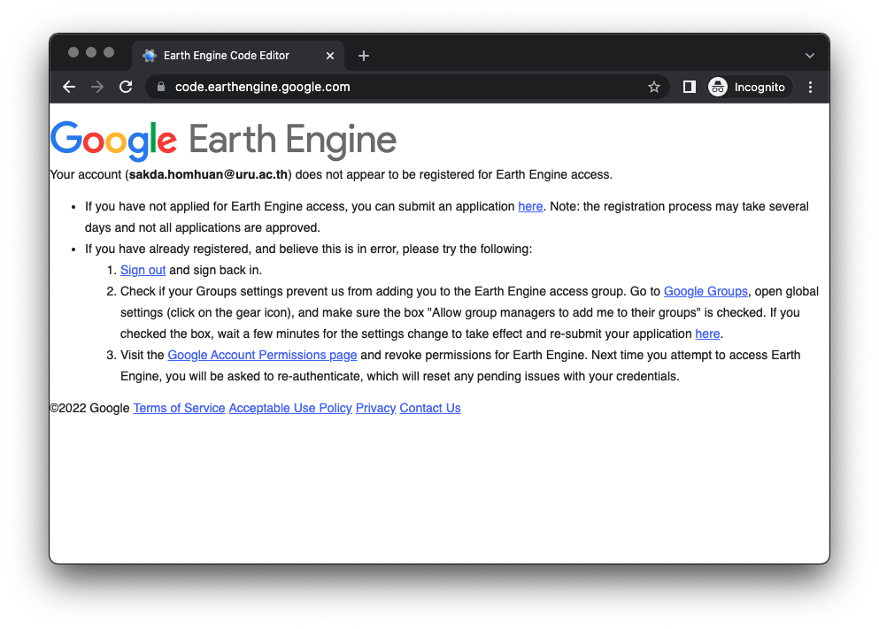
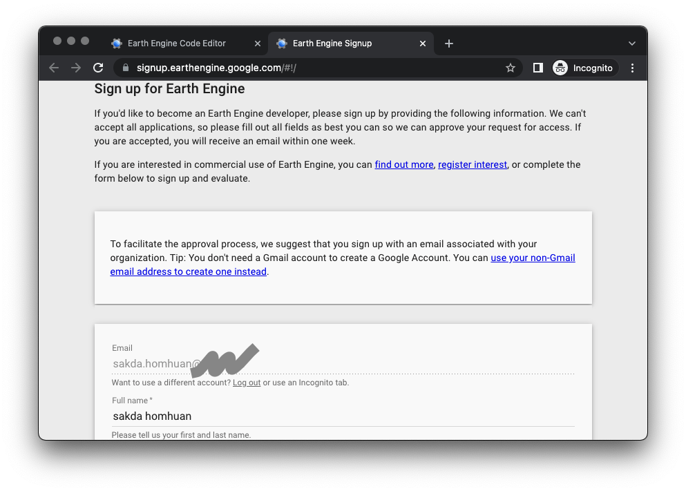
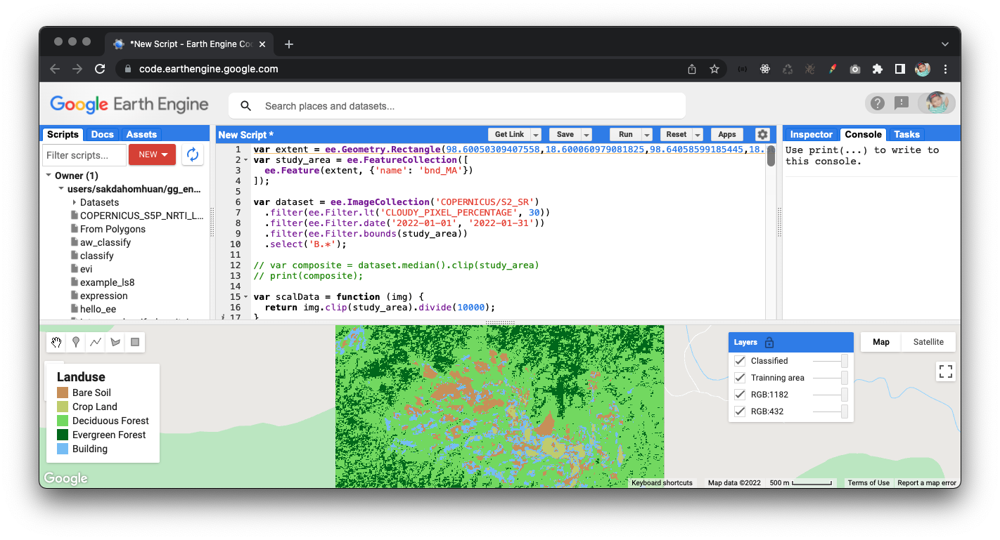

# การใช้งาน google earth engine
Earth Engine เป็นระบบบริการการประมวลผลข้อมูลภูมิสารสนเทศ (geospatial processing service) ที่พัฒนาโดย google เป็นคลังข้อมูลจากการสำรวจระยะไกลและชุดข้อมูลเชิงพื้นที่หลายเพตะไบต์
ที่สามารถวิเคราะห์ข้อมูลเชิงพื้นที่ขนาดใหญ่จากเครื่องมือประมลผลข้อมูลภูมิสารสนเทศบนระบบคลาวด์ เอื้อให้นักวิทยาศาสตร์ นักวิจัย และนักพัฒนาสามารถใช้ Earth Engine เพื่อตรวจจับการเปลี่ยนแปลง 
วิเคราะห์ข้อมูลเชิงปริมาณด้านต่างๆ ของพื้นผิวโลก Earth Engine เปิดให้ใช้งานในเชิงพาณิชย์แล้ว แต่ยังคงให้บริการฟรีสำหรับการใช้งานด้านวิชาการและการวิจัย

Table of content
* [การเข้าใช้งาน](#การเข้าใช้งาน)
* [หน้าต่างการทำงาน](#หน้าต่างการทำงาน)
* [การเขียน JavaScriptเบื้องต้น สำหรับ Earth Engine](#การเขียน-JavaScript-เบื้องต้น-สำหรับ-Earth-Engine)
    * [การประกาศตัวแปร](#การประกาศตัวแปร)
* [ตัวอย่าง การจำแนกข้อมูลภาพ (Classification)](#ตัวอย่าง-การจำแนกข้อมูลภาพ-(Classification))

### การเข้าใช้งาน
Earth Engine สามารถเลือกใช้แบบภาษา Python หรือ JavaScript ซึ่งการทำงานแบบ JavaScript จะมี Code Editor ที่สามารถทำงานแบบ web-based บน browser เช่น google chrome 
โดยเข้าใช้งานได้ที่ [https://code.earthengine.google.com/](https://code.earthengine.google.com/) สำหรับผู้ที่เข้าใช้งานเป็นครั้งแรกต้องลงทะเบียนเพื่อขอเข้าใช้งานก่อน ซึ่งอาจใช้เวลา 1-2 วัน ในการอนุมัติ

หน้าต่างให้ลงทะเบียนเพื่อขอให้งาน


### หน้าต่างการทำงาน
หลังจากที่ได้รับอนุมัติให้ใช้งานแล้ว เมื่อเข้าไปยัง [https://code.earthengine.google.com/](https://code.earthengine.google.com/) จะพบ Code Editor เพื่อใช้สำหรับทำงาน โดยมีเมนูใช้งานดังนี้

ที่มาของภาพ https://developers.google.com/earth-engine

### การเขียน JavaScript เบื้องต้น สำหรับ Earth Engine
#### การประกาศตัวแปร
การประกาศตัวแปรของ JavaScript จะขึ้นต้น var โดยสามารถกำหนดตัวแปรเป็นประเภทต่างๆ ดังนี้
```js
// undefined
var x;
// Number
var length = 16; 
// String
var lastName = "Homhuan"; 
// Boolean
var isTrue = true; 
// Array
var array = [0,1,2,3,4,5,6,7,8,9]
// Object
var x = {
    firstName: "Sakda",
    lastName: "Homhuan"
}; 
```
#### การเขียนฟังก์ชัน
การเขียนฟังก์ชันต้องระบุคำว่า function ก่อนเสมอ และระบุชื่อให้กับฟังก์ชั่นหลังก่อน () ซึ่งฟังก์ชั่นสามารถแบ่งออกเป็นแบบต้องการ parameter และแบบไม่ต้องการ parameter
การเขัยนฟังก์ชันแบบไม่ต้องการ parameter เขียนได้ ดังนี้
```js
function showMessage() {
    var firstName = "sakda"; 
    var lastName = "homhuan";
    alert(firstName + " " + lastName);
}
```
การเรียกใช้งานฟังก์ชันทำได้ ดังนี้
```js
showMessage();
```
ใช้ return หากต้องการค่ากลับคืนจากฟังก์ชัน ดังนี้
```js
function add(){
    return 1 + 2;
}

add();
```
เราสามารถกำหนดการใช้งานฟังก์ชันแบบตัวแปรได้ ดังนี้
```js
var addData = add();
console.log(addData);
```
การเขียนฟังก์ชันแบบต้องการ parameter
```js
function sum(a, b) {
    return a + b;
}
```
เรียกใช้งานฟังก์ชันแบบต้องการ parameter ดังนี้
```js
var result = sum(1, 2);
console.log(result); // 3
```
#### การกำหนดเงื่อนไข
ใช้คำสั่ง if เพื่อกำหนดเงื่อนไข
```js
if (year == 2020) {
    alert("That's correct!");
    alert("You're so smart!");
}
```
หากต้องการกำหนดเงื่อนไขเพิ่ม สามารถใช้ else if ดังนี้
```js
if (year < 2020) {
    alert('Too early...');
} else if (year > 2020) {
    alert('Too late');
} else {
    alert('Exactly!');
}
```
สามารถใช้ switch ในการกำหนดเงื่อนไข ได้ ดังนี้
```js
var a = 2 + 2;

switch (a) {
    case 3:
        alert('Too small');
        break;
    case 4:
        alert('Exactly!');
        break;
    case 5:
        alert('Too large');
        break;
    default:
        alert("I don't know such values");
}
```
#### การทำซ้ำ
สามารถใช้คำสั่ง while หรือ for เพื่อการทำซ้ำ (loop)


การใช้ “while” loop
```js
while (condition) {
  // ... loop body ...
}
// ตัวอย่าง
let i = 0;
while (i < 3) { // shows 0, then 1, then 2
    alert(i);
    i++;
}
```
การใช้ “for” loop
```js
for (begin; condition; step) {
  // ... loop body ...
}
// ตัวอย่าง
for (let i = 0; i < 3; i++) { // shows 0, then 1, then 2
    alert(i);
}
```
การใช้ "for in" loop
```js
for (variable in array) {
  // ... loop body ...
}
// ตัวอย่าง
var numbers = [1, 2, 3, 4, 5, 6, 7, 8, 9, 0];
let txt = "";
for (let x in numbers) {
  txt += numbers[x];
}
```
### ตัวอย่าง การจำแนกข้อมูลภาพ (Classification) 
กำหนด extent ของพื้นที่ศึกษา
```js
var extent = ee.Geometry.Rectangle(98.60050309407558,18.600060979081825,98.64058599185445,18.568655533373086);
```
สร้าง FeatureCollection จาก Geometry
```js
var study_area = ee.FeatureCollection([
  ee.Feature(extent, {'name': 'bnd_MA'})
]);
```
สร้าง dataset ของภาพที่ต้องการนำมาใช้
```js
var dataset = ee.ImageCollection('COPERNICUS/S2_SR')
```
เลือกข้อมูลจากการปกคลุมของเมฆ
```js
  .filter(ee.Filter.lt('CLOUDY_PIXEL_PERCENTAGE', 30))
```
เลือกวันที่ของข้อมูลที่ต้อง
```js
  .filter(ee.Filter.date('2022-01-01', '2022-01-31'))
```
เลือกขอบเขตของข้อมูลจาก FeatureCollection ของพื้นที่ศึกษา 
```js
  .filter(ee.Filter.bounds(study_area))
```
เลือก band ของข้อมูลภาพที่ต้องการใช้งาน
```js  
  .select('B.*')
```
สร้างฟังก์ชันตัดข้อมูลตามขนาดของพื้นที่ศึกษาและ scale ข้อมูลจาก int to float
```js
var scalData = function (img) {
  return img.clip(study_area).divide(10000);
}
```
เรีกฟังก์ชัน scalData
```js
var s2 = dataset.map(scalData)
```
กำหนดตำแหน่งการแสดงผล
```js
Map.centerObject(study_area, 14);
```
แสดงผลโดยการผสมแบบ true color composite และ false color composite
```js
Map.addLayer(s2.median(), {min:0.0, max:0.4, bands: ['B4', 'B3', 'B2']}, 'RGB:432');  
Map.addLayer(s2.median(), {min:0.0, max:0.4, bands: ['B11', 'B8', 'B2']}, 'RGB:1182');
```

สรา้ง Training area เพื่อเก็บข้อมูลให้เครื่องฝึกเรียนรู้ แบบ Rectangle
```js
var bareSoil = ee.Geometry.Rectangle(98.62616882242132,18.58225882687881,98.6265443316834,18.581953741275164);
var cropLand = ee.Geometry.Rectangle(98.62591102622285, 18.58020150995087, 98.62627580664888, 18.579876081359373);
var forest1 = ee.Geometry.Rectangle(98.62741594658405,18.58581682027496,98.62795238838703,18.585267677260802);
var forest2 = ee.Geometry.Rectangle(98.63757900964077,18.579358673749272,98.63837294350918,18.578545097082692);
var building = ee.Geometry.Rectangle(98.6232372413925,18.583705967136666,98.62355374205626,18.583156817320013); 
var building2 = ee.Geometry.Rectangle(98.62373812203315,18.585700781799776,98.62391514782813,18.585522818858564);
```
สร้าง FeatureCollection ของ Training area โดยกำหนดเป็น class แบบต่าง ๆ
```js
var roi = ee.FeatureCollection([
  ee.Feature(bareSoil, {'class': 1}),  
  ee.Feature(cropLand, {'class': 2}),  
  ee.Feature(forest2, {'class': 3}),  
  ee.Feature(forest1, {'class': 4}),  
  ee.Feature(building, {'class': 5}), 
]);
```
สร้าง label ของ class
```js
var names = ['Bare Soil','Crop Land','Deciduous Forest','Evergreen Forest','Building'];
```
แสดง Training area
```js
Map.addLayer(roi,{color:'red', fillColor:'00000000'},"Trainning area");
```
สร้างตัวแปร array เพื่อกำหนด band สำหรับใช้ classify
```js
var bands = ['B2', 'B8', 'B11'];
```
สรา้งตัวแปร trainning เพื่อให้เครื่องเรียนรู้ตัวอย่างข้อมูลจาก training area
```js
var training = composite.sampleRegions({
  collection: roi, 
  properties: ['class'], 
  scale: 30
});
```
เลือกวิธีการสำหรับ classify ข้อมูล แบบ [Random Forest classifier](https://developers.google.com/earth-engine/apidocs/ee-classifier-smilerandomforest) และระบุพารามิเตอร์ที่จำเป็นลงไป
```js
var smileRandomForest = ee.Classifier.smileRandomForest({
  numberOfTrees : 100
});
```
เลือกวิธีการสำหรับ classify ข้อมูล แบบ [Support Vector Machine](https://developers.google.com/earth-engine/apidocs/ee-classifier-libsvm) และระบุพารามิเตอร์ที่จำเป็นลงไป
```js
var libsvm = ee.Classifier.libsvm({
  kernelType: 'RBF',
  gamma: 0.5,
  cost: 10
});
```    
ฝึกให้เครื่องเรียนรู้ด้วยเมธอด train()
```js
var trained = smileRandomForest.train(training, 'class', bands);
```
จำแนกข้อมูลด้วยเมธอด classify()
```js
var classified = composite.classify(trained);
```

กำหนดค่าสีเพื่อใช้ในการแสดงผลค่าที่ classify ได้
```js
var palette = ['#c9995c', '#c7d270', '#8add60', '#097210', '#8bc4f9'];
```
แสดงผลค่าที่ classify ได้
```js
Map.addLayer(classified, {min: 1, max: 5, palette: palette}, 'Classified'); 
```
สร้าง legend panel
```js
var legend = ui.Panel({
  style: {
    position: 'bottom-left',
    padding: '8px 15px'
  }
});
```
กำหนด legend title
```js
var legendTitle = ui.Label({
  value: 'Landuse',
  style: {
    fontWeight: 'bold',
    fontSize: '18px',
    margin: '0 0 4px 0',
    padding: '0'
    }
});
```
ใส่ title ไปใน panel
```js
legend.add(legendTitle);
```
สร้าง template ของ legend item
```js
var makeRow = function(color, name) {
      var colorBox = ui.Label({
        style: {
          backgroundColor: color,
          padding: '8px',
          margin: '0 0 4px 0'
        }
      });

      var description = ui.Label({
        value: name,
        style: {margin: '0 0 4px 6px'}
      });

      return ui.Panel({
        widgets: [colorBox, description],
        layout: ui.Panel.Layout.Flow('horizontal')
      });
};
```
เพิ่มข้อมูลเข้าไปยัง legend panel
```js
var items = [1,2,3,4,5];
for(var i in items) {
  legend.add(makeRow(palette[i], names[i]));
}  
``` 
เพิ่ม legend เข้าไปยังแผนที่
```js
Map.add(legend);
```
ส่งข้อมูลไปยัง google drive
```js
Export.image.toDrive({
  image: classified,
  description: 'classify_MA',
  folder: 'GEE_data',
  region: study_area,
  scale: 12.5,
  crs: 'EPSG:32647'
});
```
ผลการทำงาน



