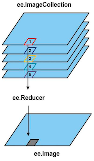
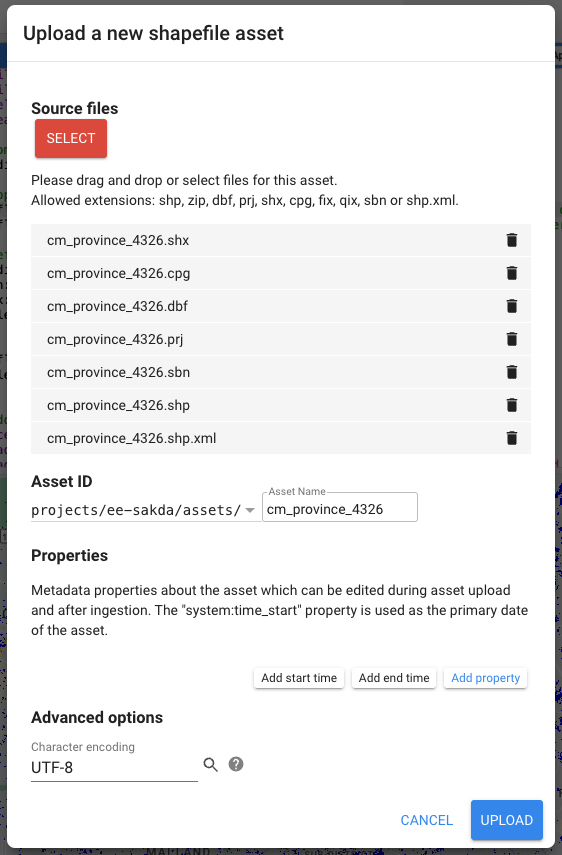
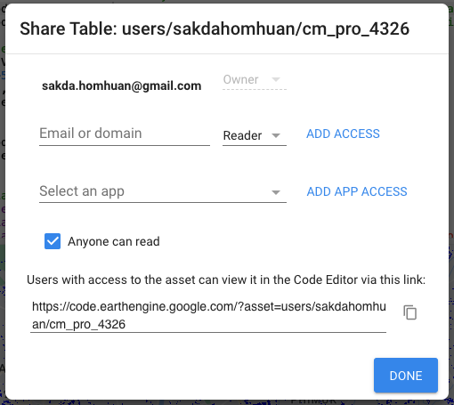

# การอบรมเชิงปฏิบัติการแนะนำ Google Earth Engine

เนื้อหาการอบรมเชิงปฏิบัติการเกี่ยวกับ Google Earth Engine (GEE) นี้ถูกออกแบบมาเพื่อแนะนำพื้นฐานของ GEE โดยมีตัวอย่างการใช้ประโยชน์จากความสามารถในการวิเคราะห์ข้อมูลทางภูมิศาสตร์

## สารบัญ

1. [การแนะนำ Google Earth Engine](#1-การแนะนำ-google-earth-engine)
2. [การเริ่มต้นใช้งาน GEE](#2-การเริ่มต้นใช้งาน-gee)
3. [การทำงานกับชุดข้อมูล](#3-การทำงานกับชุดข้อมูล)
4. [เทคนิคการแสดงผล](#4-เทคนิคการแสดงผล)
5. [การประมวลผลและวิเคราะห์ภาพ](#5-การประมวลผลและวิเคราะห์ภาพ)
6. [การส่งออกข้อมูล](#6-การส่งออกข้อมูล)
7. [กรณีศึกษาและการประยุกต์ใช้](#7-กรณีศึกษาและการประยุกต์ใช้)

---

## 1. การแนะนำ Google Earth Engine

### Google Earth Engine คืออะไร?

Google Earth Engine เป็นแพลตฟอร์มบนคลาวด์สำหรับการวิเคราะห์ข้อมูลสิ่งแวดล้อม ที่รวบรวมข้อมูลขนาดใหญ่ (Big data) ของภาพถ่ายดาวเทียมและชุดข้อมูลทางภูมิศาสตร์เข้ากับชุดเครื่องมือในการวิเคราะห์ข้อมูล ทำให้ผู้ใช้สามารถแสดงผล ตรวจจับการเปลี่ยนแปลง สร้างแผนที่แนวโน้ม และหาปริมาณความแตกต่างของข้อมูลบนพื้นผิวโลก

### การประยุกต์ใช้ GEE

- **การติดตามสิ่งแวดล้อม:** ติดตามการตัดไม้ทำลายป่า การกลายเป็นทะเลทราย และการเปลี่ยนแปลงการใช้ที่ดิน
- **การจัดการภัยพิบัติ:** วิเคราะห์พื้นที่ที่ได้รับผลกระทบจากน้ำท่วม ไฟไหม้ และพายุเฮอริเคน
- **การเกษตร:** ติดตามสุขภาพของพืช ประมาณการผลผลิต และจัดการทรัพยากร
- **การวางผังเมือง:** ศึกษาการขยายตัวของเมือง การพัฒนาสาธารณูปโภค และการแบ่งเขต
- **การศึกษาการเปลี่ยนแปลงสภาพภูมิอากาศ:** ประเมินผลกระทบ สร้างแบบจำลองสถานการณ์ และวางแผนกลยุทธ์การบรรเทา

### ภาพรวมของอินเทอร์เฟซ GEE

- **Code Editor:** อินเทอร์เฟซหลักสำหรับการเขียนและรันสคริปต์
- **Console:** แสดงผลลัพธ์จากคำสั่ง `print` และข้อความข้อผิดพลาด
- **Inspector:** อนุญาตให้คุณคลิกบนแผนที่เพื่อตรวจสอบค่าพิกเซล
- **Map Display:** แสดงชั้นข้อมูลเชิงภูมิศาสตร์

[กลับสู่สารบัญ](#สารบัญ)

---

## 2. การเริ่มต้นใช้งาน GEE

### การเข้าถึง GEE

1. **สมัครใช้งาน:** ไปที่ [หน้าสมัคร Google Earth Engine](https://earthengine.google.com/signup/) และลงทะเบียนด้วยบัญชี Google
2. **การอนุมัติ:** รอการอนุมัติ ซึ่งปกติจะใช้เวลา 1-3 วัน
3. **เข้าถึง Code Editor:** เมื่อได้รับการอนุมัติ สามารถเข้าไปใช้งานที่ [GEE Code Editor](https://code.earthengine.google.com/)

### หน้าต่างและเมนูใน Code Editor

- **แท็บ Scripts:** จัดการและจัดระเบียบสคริปต์ของคุณ
- **แท็บ Docs:** เข้าถึงเอกสาร ตัวอย่าง และข้อมูลชุดข้อมูล
- **แท็บ Assets:** ดูและจัดการชุดข้อมูลที่เราอัปโหลด


### การแนะนำ JavaScript สำหรับ GEE และการทำงานระหว่าง Client-Server

Google Earth Engine ใช้ JavaScript เป็นภาษาสคริปต์หลักใน Code Editor การมีความเข้าใจพื้นฐานเกี่ยวกับ JavaScript จะช่วยให้เราสามารถพัฒนาสคริปต์ที่มีประสิทธิภาพและยืดหยุ่นได้

#### พื้นฐานของ JavaScript ที่สำคัญสำหรับ GEE

- **ตัวแปร (Variables):** ใช้ `var`, `let`, หรือ `const` เพื่อประกาศตัวแปร
  ```javascript
  var x = 10;
  let y = 20;
  const z = 30;
  ```
  
- **ประเภทข้อมูล (Data Types):** String, Number, Boolean, Array, Object
  ```javascript
  var name = 'Earth Engine';
  var number = 42;
  var isTrue = true;
  var array = [1, 2, 3];
  var object = {key: 'value'};
  ```
  
- **ฟังก์ชัน (Functions):** กำหนดฟังก์ชันเพื่อใช้ซ้ำ
  ```javascript
  function greet(name) {
    return 'Hello, ' + name;
  }
  ```
  
- **ตัวดำเนินการ (Operators):** การคำนวณและการเปรียบเทียบ
  ```javascript
  var sum = x + y;
  var isEqual = x === y;
  ```
  
- **การควบคุมการการทำงาน (Control Flow):** if-else, for-loop, while-loop
  ```javascript
  if (x > y) {
    // ทำบางอย่าง
  } else {
    // ทำอย่างอื่น
  }

  for (var i = 0; i < 10; i++) {
    // ทำบางอย่าง
  }
  ```

<mark>**ทดลอง:** การนำเข้า Image </mark>

```javascript
  var a = "hello";
  var b = ee.String("world");
  print(typeof(a), typeof(b))

  function greet(name) {
    return 'Hello, ' + name;
  }

  var c = greet("Poon");
  print(c);

  var x = 5;
  var y = 4;

  var sum = x + y;
  var isEqual = x === y;

  if (x > y) {
    print("x > y");
  } else {
    print("x < y");
  }

  for (var i = 0; i < 10; i++) {
    print(i);
  }
```

### การทำงานระหว่าง Client และ Server ใน GEE

หนึ่งในแนวคิดที่สำคัญในการเขียนสคริปต์ GEE คือความเข้าใจเกี่ยวกับการทำงานระหว่างฝั่งลูกข่าย (Client-side) และฝั่งเซิร์ฟเวอร์ (Server-side)

#### ฝั่งเซิร์ฟเวอร์ (Server-side)

- การดำเนินการส่วนใหญ่ใน GEE เกิดขึ้นบนเซิร์ฟเวอร์ของ Google 
- อ็อบเจ็กต์ของ GEE มีคำนำหน้า `ee` เป็นอ็อบเจ็กต์ฝั่งเซิร์ฟเวอร์ เช่น `ee.Image`, `ee.Geometry`, `ee.FeatureCollection` 
- การดำเนินการบนอ็อบเจ็กต์เหล่านี้เป็นแบบเลื่อนเวลา (Lazy Evaluation) และไม่เกิดขึ้นจนกว่าจะถูกเรียกใช้  
[อ่านเพิ่มเติม](https://medium.com/scb-techx/%E0%B8%97%E0%B8%B3%E0%B8%84%E0%B8%A7%E0%B8%B2%E0%B8%A1%E0%B9%80%E0%B8%82%E0%B9%89%E0%B8%B2%E0%B9%83%E0%B8%88%E0%B8%81%E0%B8%B2%E0%B8%A3%E0%B8%97%E0%B8%B3%E0%B8%87%E0%B8%B2%E0%B8%99%E0%B9%81%E0%B8%9A%E0%B8%9A-lazy-evaluation-%E0%B9%83%E0%B8%99-pyspark-1d71bc33b831)

#### ฝั่งลูกข่าย (Client-side)

- ตัวแปรและฟังก์ชัน JavaScript มาตรฐานอยู่บนฝั่งลูกข่าย
- คำสั่งที่ควบคุมการทำงานและการประมวลผลข้อมูลที่ไม่ใช่ GEE เกิดขึ้นบนฝั่งลูกข่าย
- ค่า Client-side สามารถเข้าถึงและประมวลผลได้ทันที

#### การสื่อสารระหว่าง Client และ Server

- การสื่อสารระหว่างฝั่งลูกข่ายและเซิร์ฟเวอร์เกิดขึ้นเมื่อคุณร้องขอค่า (เช่น `getInfo()` หรือ `evaluate()`)
- การเรียกใช้ `getInfo()` อาจทำให้สคริปต์ช้าลงหรือหยุดทำงาน เนื่องจากมันรอการตอบสนองจากเซิร์ฟเวอร์
- ควรหลีกเลี่ยงการใช้ `getInfo()` ควรใช้การทำงานแบบ Asynchronous แทน

#### ตัวอย่างการทำงานระหว่าง Client-Server

ตัวอย่าง: การใช้ `getInfo()` (ไม่แนะนำ)

```javascript
var count = filteredCollection.size().getInfo();
print('จำนวนภาพ:', count); // ค่า count เป็น Client-side
```

ตัวอย่าง: การใช้ `evaluate()` (แนะนำ)

```javascript
filteredCollection.size().evaluate(function(count) {
  print('จำนวนภาพ:', count); // ค่า count เป็น Client-side ภายในฟังก์ชัน callback
});
```

### แนวทางปฏิบัติที่ดี

- หลีกเลี่ยงการใช้ `getInfo()` ควรใช้ `evaluate()` เพื่อป้องกันการหยุดทำงานของสคริปต์
- เข้าใจความแตกต่างของอ็อบเจ็กต์ฝั่งเซิร์ฟเวอร์และลูกข่าย อย่าพยายามใช้ค่าฝั่งเซิร์ฟเวอร์ในบริบทที่ต้องการค่าฝั่งลูกข่าย
- ใช้การแมปฟังก์ชันบนอ็อบเจ็กต์ฝั่งเซิร์ฟเวอร์ เช่น การใช้ `map()` บน `ee.ImageCollection`

### ตัวอย่างเพิ่มเติม

ตัวอย่าง: การคำนวณพื้นที่ของโพลิกอน

```javascript
var area = polygon.area(); // ค่า area เป็นฝั่งเซิร์ฟเวอร์ (ee.Number)
print('พื้นที่:', area); // จะแสดง ee.Number

// การแปลงค่าเป็น Client-side
area.evaluate(function(val) {
  print('พื้นที่ (ตารางเมตร):', val);
});
```

ตัวอย่าง: การใช้ค่าฝั่งเซิร์ฟเวอร์ในฟังก์ชันฝั่งลูกข่าย

```javascript
var imageCount = filteredCollection.size();

if (imageCount > 0) { // จะเกิดข้อผิดพลาด เนื่องจาก imageCount เป็น ee.Number (ฝั่งเซิร์ฟเวอร์)
  print('มีภาพในคอลเลกชัน');
}

// วิธีที่ถูกต้อง
imageCount.evaluate(function(count) {
  if (count > 0) {
    print('มีภาพในคอลเลกชัน');
  } else {
    print('ไม่มีภาพในคอลเลกชัน');
  }
});
```

<mark>**ทดลอง:** javascript</mark>
```js
var polygon = ee.Geometry.Polygon([
  [
    [98.89147187028489, 18.853624853147792],
    [98.89147187028489, 18.715809744071084],
    [99.08922577653489, 18.715809744071084],
    [99.08922577653489, 18.853624853147792]
  ]
]);

Map.centerObject(polygon, 12);
Map.addLayer(polygon, {color: 'blue'}, 'Chiang mai');

var area = polygon.area(); 
print('area (m2):', area);
```

[กลับสู่สารบัญ](#สารบัญ)

---

## 3. การทำงานกับชุดข้อมูล

การทำงานกับชุดข้อมูลเป็นส่วนสำคัญของการใช้งาน GEE เนื่องจาก GEE มีคลังข้อมูลเชิงภูมิศาสตร์ขนาดใหญ่ที่สามารถนำมาใช้ในการวิเคราะห์และวิจัย ในส่วนนี้ เราจะสำรวจวิธีการค้นหา นำเข้า และจัดการชุดข้อมูลใน GEE อย่างละเอียด

### 3.1 การสำรวจคลังข้อมูล (Data Catalog)

GEE มีคลังข้อมูล (Data Catalog) ขนาดใหญ่ที่รวบรวมชุดข้อมูลเชิงภูมิศาสตร์จากแหล่งต่าง ๆ ทั่วโลก ชุดข้อมูลเหล่านี้รวมถึง:

- **ภาพถ่ายดาวเทียม:** เช่น Landsat, Sentinel, MODIS
- **ข้อมูลสภาพภูมิอากาศ:** เช่น อุณหภูมิ ปริมาณน้ำฝน
- **ข้อมูลการใช้ที่ดินและการครอบคลุมพื้นดิน:** เช่น Global Land Cover
- **ข้อมูลเชิงสถิติและประชากรศาสตร์:** เช่น ข้อมูลประชากร
- **ข้อมูลภูมิประเทศ:** เช่น แบบจำลองระดับความสูงดิจิทัล (DEM)

#### วิธีการเข้าถึงคลังข้อมูล

- ไปที่ [คลังข้อมูล GEE](https://developers.google.com/earth-engine/datasets/) เพื่อสำรวจชุดข้อมูลที่มีอยู่
- ใน Code Editor แท็บ **Docs** จะมีรายการชุดข้อมูลที่สามารถค้นหาและนำมาใช้ได้
- เราสามารถค้นหาชุดข้อมูลโดยใช้คำสำคัญหรือกรองตามประเภทข้อมูล

### 3.2 การนำเข้าชุดข้อมูล

#### 3.2.1 Feature Collections

- **FeatureCollection (ee.FeatureCollection):** เป็นชุดของเรขาคณิต (Geometry) และคุณสมบัติ (Property) ทางด้านภูมิศาสตร์​ เช่น ขอบเขตประเทศ เส้นทางแม่น้ำ จุดสถานที่สำคัญ

<mark>**ทดลอง:** การนำเข้าชุดข้อมูลขอบเขตประเทศ </mark>

```javascript
var countries = ee.FeatureCollection('USDOS/LSIB_SIMPLE/2017');
var thailand = countries.filter(ee.Filter.eq('country_na', 'Thailand'));

Map.centerObject(thailand, 6);
Map.addLayer(thailand.style({
  color: 'red',           // Outline color
  fillColor: '00000000',  // Transparent fill
  width: 2                // Line width
}), {}, 'Thailand');
```

<mark>**ทดลอง:** การแสดงรายละเอียดข้อมูล FeatureCollection</mark>

```javascript
var countryNames = countries.aggregate_array('country_na').distinct().sort();
print('Country Names:', countryNames);
```

ใน GEE ชุดข้อมูล Raster แบ่งออกเป็นสองประเภทหลัก:

- Image and Image Collections
- Feature Collections

#### 3.2.2 Image and Image Collections

- **Image (ee.Image):** เป็นภาพราสเตอร์เดี่ยว ซึ่งอาจเป็นภาพถ่ายดาวเทียม ภาพแผนที่ หรือข้อมูลเชิงพื้นที่อื่น ๆ
- **Image Collections (ee.ImageCollection):** เป็นชุดของภาพที่มีความเกี่ยวข้องกัน เช่น ภาพทั้งหมดจากดาวเทียม Landsat 8 ในช่วงเวลาหนึ่ง



<mark>**ทดลอง:** การนำเข้า Image </mark>

```js
var visParams = {
  bands: ['B4', 'B3', 'B2'],
  min: 0,
  max: 3000,
};

var image = ee.Image('COPERNICUS/S2_SR/20240104T035141_20240104T035408_T47QMA');
Map.centerObject(image, 10);
Map.addLayer(image, visParams, 'Sentinel-2 Image', 0);
```

<mark>**ทดลอง:** การนำเข้า Image Collections </mark>

```js
var collection = ee.ImageCollection("COPERNICUS/S2_SR_HARMONIZED")
                      .filterDate('2024-01-01', '2024-02-28')
                      .filterBounds(polygon)
                      .filter(ee.Filter.lt('CLOUDY_PIXEL_PERCENTAGE',20));

print('Number of images:', collection.size());
Map.centerObject(polygon, 12);
Map.addLayer(collection.median(), visParams, 'Sentinel-2 ImageCollection', 0);
```

เราสามารถตรวจสอบข้อมูลเมตาของ Image Collections ได้โดยใช้ฟังก์ชัน `print()`

<mark>**ทดลอง:** ตรวจสอบข้อมูลเมตาของ Image Collections</mark>

```javascript
print('Number of images:', collection.size());
print('Sentinel-2 ImageCollection:', collection);
```


### 3.3 การกรองและเลือกข้อมูล

การกรองข้อมูลช่วยให้สามารถเลือกข้อมูลที่ต้องการสำหรับการวิเคราะห์ โดยลดปริมาณข้อมูลที่ไม่จำเป็น

#### 3.3.1 การกรองตามช่วงเวลา (Temporal Filtering)

ใช้ฟังก์ชัน `.filterDate()` เพื่อเลือกภาพในช่วงเวลาที่กำหนด

ตัวอย่าง: การกรองภาพ Landsat 8 ในปี 2023

```javascript
var collection = ee.ImageCollection('COPERNICUS/S2_SR')
var filteredByDate = collection.filterDate('2024-02-01', '2024-02-28');
```

#### 3.3.2 การกรองเชิงพื้นที่ (Spatial Filtering)

ใช้ฟังก์ชัน `.filterBounds()` เพื่อเลือกภาพที่ครอบคลุมพื้นที่ที่กำหนด

ตัวอย่าง: การกรองภาพที่ครอบคลุมพื้นที่กรุงเทพฯ

```javascript
var polygon = ee.Geometry.Polygon([
  [
    [98.89147187028489, 18.853624853147792],
    [98.89147187028489, 18.715809744071084],
    [99.08922577653489, 18.715809744071084],
    [99.08922577653489, 18.853624853147792]
  ]
]);
var filteredByLocation = filteredByDate.filterBounds(polygon);
```

#### 3.3.3 การกรองตามคุณสมบัติ (Property Filtering)

เราสามารถกรองข้อมูลตามคุณสมบัติของภาพ เช่น เมฆปกคลุม ความชัดเจนของภาพ เป็นต้น

**ตัวอย่าง: การกรองภาพที่มีเมฆปกคลุมน้อยกว่า 10%**

```javascript
var filteredByCloud = filteredByLocation.filter(ee.Filter.lt('CLOUD_COVER', 10));
```

#### 3.3.4 การรวมการกรองหลายแบบ

เราสามารถรวมการกรองหลายแบบเพื่อเลือกภาพที่ตรงกับเงื่อนไขทั้งหมด

<mark>**ทดลอง:** การรวมการกรองหลายแบบ</mark>

```javascript
var collection = ee.ImageCollection('COPERNICUS/S2_SR')
var imageCollection = collection
  .filterDate('2024-02-01', '2024-02-28')
  .filterBounds(polygon)
  .filter(ee.Filter.lt('CLOUDY_PIXEL_PERCENTAGE', 10));
```

### 3.4 การเลือกและจัดการแบนด์ (Bands)

ภาพถ่ายดาวเทียมมักมีแบนด์ (Bands) ที่แสดงถึงช่วงความยาวคลื่นต่าง ๆ เราสามารถเลือกแบนด์ที่ต้องการใช้ในการวิเคราะห์

ตัวอย่าง: การเลือกแบนด์จากภาพ

```javascript
var image = finalCollection.first();
var selectedBands = image.select(['B2', 'B3', 'B4']); // แบนด์ ของช่วงคลื่นสีน้ำเงิน เขียว แดง
```

### 3.5 การประมวลผลข้อมูล Metadata

แต่ละภาพหรือคุณลักษณะใน GEE มี Metadata มาด้วยซึ่งเราสามารถเข้าถึงและใช้ข้อมูลเหล่านี้ในการวิเคราะห์

ตัวอย่าง: การเข้าถึงข้อมูลเมตาของภาพ

```javascript
var acquisitionDate = image.get('DATE_ACQUIRED');
var cloudCover = image.get('CLOUD_COVER');
```

<mark>**ทดลอง:** การเข้าถึงข้อมูลเมตาของภาพ<mark>
```js
var acquisitionDate = image.get('system:time_start');
print('วันที่ถ่ายภาพ:', acquisitionDate);

var cloudCover = image.get('CLOUDY_PIXEL_PERCENTAGE');
print('เมฆปกคลุม (%):', cloudCover);
```


### 3.6 การสร้างชุดข้อมูลใหม่

เราสามารถสร้างชุดข้อมูลใหม่โดยการคำนวณหรือประมวลผลจากชุดข้อมูลที่มีอยู่

ตัวอย่าง: การคำนวณดัชนีความแตกต่างของน้ำ (NDWI)

```javascript
var ndwi = image.normalizedDifference(['B3', 'B5']).rename('NDWI');
Map.addLayer(ndwi, {min: -1, max: 1, palette: ['blue', 'white']}, 'NDWI');
```

### 3.7 การจัดเก็บและแชร์ชุดข้อมูล

#### 3.7.1 การนำเข้าชุดข้อมูล

เราสามารถอัปโหลดชุดข้อมูลไปยัง GEE Assets เพื่อใช้ในการวิเคราะห์

- **การอัปโหลด Shapefile หรือ GeoJSON:** ไปที่แท็บ **Assets** ใน Code Editor แล้วคลิ๊ก **New** เพื่ออัปโหลดไฟล์
- **การอัปโหลดภาพราสเตอร์:** สามารถอัปโหลดภาพ GeoTIFF

ตัวอย่าง: การนำเข้าไฟล์ Shapefile

1. แปลง Shapefile เป็นรูปแบบ GeoJSON หรือ KML (หากจำเป็น)
2. อัปโหลดไฟล์ไปยัง Assets

([ข้อมูลขอบเขตจังหวัดเชียงใหม่](./docs/cm_province.zip))

ตัวอย่างการอัพโหลด shapefile



3. ใช้ในสคริปต์:

ตัวอย่างการใช้งาน

```javascript
var myFeatureCollection = ee.FeatureCollection('users/sakdahomhuan/cm_pro_4326');
```

#### 3.7.2 การแชร์ชุดข้อมูล

- เราสามารถแชร์ Assets กับผู้ใช้ GEE คนอื่น ๆ โดยตั้งค่าการอนุญาต (Permissions)
-  ในแท็บ **Assets** แล้วเลือก **Anyone can read**



### 3.8 แนวทางปฏิบัติที่ดี

- **ใช้การกรองให้มากที่สุดเท่าที่เป็นไปได้:** เพื่อลดปริมาณข้อมูลและเพิ่มประสิทธิภาพ
- **ตรวจสอบข้อมูลเมตา:** เพื่อเข้าใจคุณสมบัติของภาพและความเหมาะสมในการใช้งาน
- **ทำความเข้าใจกับแบนด์ต่าง ๆ ของภาพดาวเทียม:** แต่ละดาวเทียมมีแบนด์ที่แตกต่างกัน
- **ใช้ฟังก์ชันการแมป (Map Functions):** เพื่อประมวลผล ImageCollection อย่างมีประสิทธิภาพ
- **จัดการและตั้งชื่อตัวแปรอย่างชัดเจน:** เพื่อความเข้าใจและการบำรุงรักษาโค้ด

[กลับสู่สารบัญ](#สารบัญ)

---

## 4. เทคนิคการแสดงผล

การแสดงผลข้อมูลเชิงภูมิศาสตร์เป็นส่วนสำคัญในการวิเคราะห์และสื่อสารผลลัพธ์ใน GEE เทคนิคต่าง ๆ ในการแสดงผลข้อมูลบนแผนที่ การปรับแต่งการแสดงผล และการสร้างเครื่องมือช่วยในการแสดงผล มีดังนี้

### 4.1 การแสดงข้อมูลบนแผนที่

GEE อนุญาตให้คุณแสดงข้อมูลเชิงภูมิศาสตร์บนแผนที่ใน Code Editor โดยใช้ฟังก์ชัน `Map.addLayer()` ซึ่งมีรูปแบบดังนี้:

```javascript
Map.addLayer(ชั้นข้อมูล, พารามิเตอร์การแสดงผล, 'ชื่อชั้นข้อมูล', แสดงผล, เลเยอร์อินเด็กซ์);
```

- **ชั้นข้อมูล:** สามารถเป็น `ee.Image`, `ee.Geometry`, `ee.Feature`, หรือ `ee.FeatureCollection`
- **พารามิเตอร์การแสดงผล (visParams):** วัตถุที่กำหนดวิธีการแสดงผลของข้อมูล
- **ชื่อชั้นข้อมูล:** ชื่อที่จะแสดงในแผงเลเยอร์
- **แสดงผล (visibility):** ตัวแปร Boolean ที่กำหนดว่าจะให้แสดงชั้นข้อมูลหรือไม่ (ค่าเริ่มต้นคือ `true`)
- **เลเยอร์อินเด็กซ์ (layerOpacity):** ค่าโปร่งแสงของชั้นข้อมูล (0 ถึง 1)

<mark>**ทดลอง:** การแสดงภาพดาวเทียม Landsat 8</mark>

```javascript
var landsat9 = ee.ImageCollection('LANDSAT/LC09/C02/T1_L2')
  .filterBounds(polygon)                          // Filter by polygon
  .filterDate('2024-01-01', '2024-10-01')         // Filter by date range
  .filter(ee.Filter.lt('CLOUD_COVER', 20))
  .first();
Map.addLayer(landsat9, {bands: ['SR_B4', 'SR_B3', 'SR_B2'], min: 7000, max: 12000}, 'Landsat9 True Color Image');
```

### 4.2 การใช้พารามิเตอร์การแสดงผล (Visualization Parameters)

พารามิเตอร์การแสดงผลช่วยให้คุณสามารถปรับแต่งวิธีการแสดงผลของข้อมูลบนแผนที่

#### 4.2.1 การเลือกแบนด์ (Bands)

สำหรับข้อมูลภาพหลายแบนด์ สามารถเลือกแบนด์ที่ต้องการแสดงผลได้

ตัวอย่าง: การแสดงภาพอินฟราเรด แบบผสมสีเท็จ

```javascript
Map.addLayer(image, {bands: ['B5', 'B4', 'B3'], min: 0, max: 3000}, 'False Color Image');
```

#### 4.2.2 การกำหนดช่วงค่าขั้นต่ำและสูงสุด (Min and Max)

กำหนดค่าขั้นต่ำ (`min`) และค่าสูงสุด (`max`) สำหรับการสเกลค่าพิกเซล

ตัวอย่าง: การปรับค่าขั้นต่ำและสูงสุด

```javascript
Map.addLayer(image, {bands: ['B4', 'B3', 'B2'], min: 500, max: 3500}, 'Adjusted True Color');
```

<mark>**ทดลอง:** สามารถเลือกแบนด์ที่ต้องการแสดงผล</mark>

```JS
Map.addLayer(landsat9, {bands: ['SR_B4', 'SR_B3', 'SR_B2'], min: 7000, max: 12000}, 'Landsat9 True Color Image');
Map.addLayer(landsat9, {bands: ['SR_B5', 'SR_B4', 'SR_B3'], min: 7000, max: 12000}, 'Landsat9 False Color Image');
```

#### 4.2.3 การใช้ Palette

สำหรับข้อมูลภาพที่มีแบนด์เดียว เราสามารถกำหนดจานสีเพื่อแสดงค่าต่าง ๆ ด้วยสีที่แตกต่างกัน

<mark>**ทดลอง:** การแสดง NDVI ด้วย palette</mark>

```javascript
var ndvi = image.normalizedDifference(['B5', 'B4']).rename('NDVI');

var ndviParams = {
  min: -1,
  max: 1,
  palette: ['blue', 'white', 'green']
};

Map.addLayer(ndvi, ndviParams, 'NDVI');
```

### 4.3 การสร้างคำอธิบายสี (Legend)

แม้ว่า GEE จะไม่มีฟังก์ชันสร้างคำอธิบายสีในตัว แต่เราสามารถสร้างคำอธิบายสีแบบกำหนดเองโดยใช้โมดูล `ui`

<mark>**ทดลอง:** การสร้างคำอธิบายสีสำหรับ NDVI</mark>

```javascript
// ฟังก์ชันสร้างคำอธิบายสี
function createLegend(title, palette, min, max) {
  var legend = ui.Panel({
    style: {
      position: 'bottom-left',
      padding: '8px 15px'
    }
  });

  // สร้างหัวเรื่อง
  var legendTitle = ui.Label({
    value: title,
    style: {fontWeight: 'bold', fontSize: '18px'}
  });
  legend.add(legendTitle);

  // สร้างกรอบสี
  var makeRow = function(color, name) {
    var colorBox = ui.Label('', {
      backgroundColor: color,
      padding: '8px',
      margin: '0 0 4px 0'
    });

    var description = ui.Label(name, {margin: '0 0 4px 6px'});

    return ui.Panel({
      widgets: [colorBox, description],
      layout: ui.Panel.Layout.Flow('horizontal')
    });
  };

  // สร้างรายการสี
  var labels = [min, (min+max)/2, max];
  for (var i = 0; i < palette.length; i++) {
    legend.add(makeRow(palette[i], labels[i].toFixed(2)));
  }

  Map.add(legend);
}

// เรียกใช้ฟังก์ชันเพื่อสร้างคำอธิบายสี
createLegend('NDVI Legend', ['blue', 'white', 'green'], -1, 1);
```

### 4.4 การสร้างส่วนติดต่อผู้ใช้ (User Interface Panels)

GEE มีโมดูล `ui` ที่ช่วยให้สามารถสร้างอินเทอร์เฟซแบบกำหนดเอง เช่น Button Slider และ Panel

<mark>**ทดลอง:** การสร้างสไลเดอร์เพื่อปรับค่าการแสดงผล</mark>

```javascript
var visParams = {
  bands: ['B4', 'B3', 'B2'],
  min: 0,
  max: 3000
};

var imageLayer = ui.Map.Layer(image, visParams, 'Adjustable Image');
Map.layers().add(imageLayer);

var minSlider = ui.Slider({
  min: 0,
  max: 3000,
  value: 0,
  step: 100,
  onChange: function(value) {
    visParams.min = value;
    imageLayer.setVisParams(visParams);
  }
});

var maxSlider = ui.Slider({
  min: 0,
  max: 3000,
  value: 3000,
  step: 100,
  onChange: function(value) {
    visParams.max = value;
    imageLayer.setVisParams(visParams);
  }
});

var controlPanel = ui.Panel({
  widgets: [
    ui.Label('Adjust Visualization Parameters'),
    ui.Label('Min Value'),
    minSlider,
    ui.Label('Max Value'),
    maxSlider
  ],
  style: {position: 'top-right'}
});

Map.add(controlPanel);
```

### 4.5 การใช้เครื่องมือตรวจสอบ (Inspector Tool)

เครื่องมือตรวจสอบช่วยให้เราสามารถคลิกบนแผนที่เพื่อดูค่าพิกเซลหรือคุณสมบัติของข้อมูลที่แสดง

- เปิดใช้งานเครื่องมือตรวจสอบโดยคลิกที่ปุ่ม **Inspector** ใน Code Editor
- คลิกบนแผนที่เพื่อดูข้อมูลในตำแหน่งนั้น

### 4.6 การปรับแต่งแผนที่

#### 4.6.1 การตั้งค่ากึ่งกลางและระดับการซูมของแผนที่

เราสามารถตั้งค่ากึ่งกลางและระดับการซูมของแผนที่โดยใช้ฟังก์ชัน `Map.setCenter()` หรือ `Map.centerObject()`

ตัวอย่าง:

```javascript
Map.setCenter(100.5018, 13.7563, 10); // พิกัดของกรุงเทพฯ, ระดับซูม 10
```

หรือ

```javascript
Map.centerObject(polygon, 12); // กึ่งกลางที่โพลิกอน, ระดับซูม 12
```

#### 4.6.2 การเพิ่มเลเยอร์หลายชั้น

เราสามารถเพิ่มเลเยอร์หลายชั้นบนแผนที่และควบคุมลำดับการแสดงผลและความโปร่งแสง

ตัวอย่าง:

```javascript
Map.addLayer(image1, visParams1, 'Layer 1');
Map.addLayer(image2, visParams2, 'Layer 2', true, 0.5); // ความโปร่งแสง 50%
```

#### 4.6.3 การเปลี่ยนแผนที่ฐาน (Basemap)

เราสามารถเปลี่ยนแผนที่ฐานเพื่อให้เหมาะกับการแสดงผล

<mark>**ทดลอง:** การเปลี่ยนเป็นแผนที่ภูมิประเทศ</mark>

```javascript
Map.setOptions('TERRAIN');
```

ตัวเลือกอื่น ๆ ได้แก่ `ROADMAP`, `TERRAIN`, `HYBRID`

### 4.7 การสร้างภาพเคลื่อนไหว (Timelapse and Video)

เราสามารถสร้างภาพเคลื่อนไหวหรือวิดีโอจาก ImageCollection

ตัวอย่าง: การสร้าง URL วิดีโอ

```javascript
var videoArgs = {
  dimensions: 720,
  region: geometry,
  framesPerSecond: 10,
  crs: 'EPSG:3857',
  min: 0,
  max: 3000,
  bands: ['B4', 'B3', 'B2']
};

var videoUrl = finalCollection.getVideoThumbURL(videoArgs);
print('Video URL:', videoUrl);
```

### 4.8 การใช้ฟังก์ชันแสดงผลแบบกำหนดเอง

เราสามารถสร้างฟังก์ชันเพื่อปรับแต่งการแสดงผลตามความต้องการ

ตัวอย่าง: ฟังก์ชันเพื่อสร้างภาพ RGB จากภาพ Sentinel-2

```javascript
function addTrueColor(image) {
  return image.visualize({
    bands: ['B4', 'B3', 'B2'],
    min: 0,
    max: 3000
  });
}

var sentinelCollection = ee.ImageCollection("COPERNICUS/S2_SR_HARMONIZED")
                          .filterDate('2020-01-01', '2020-12-31')
                          .filterBounds(geometry);

var trueColorCollection = sentinelCollection.map(addTrueColor);

Map.addLayer(trueColorCollection.first(), {}, 'Sentinel-2 True Color');
```

### 4.9 การแสดงข้อมูลเวกเตอร์

สำหรับข้อมูลเวกเตอร์ เช่น `ee.FeatureCollection` คุณสามารถปรับแต่งการแสดงผลด้วยสไตล์ต่าง ๆ

ตัวอย่าง: การแสดงขอบเขตประเทศด้วยสีแดงและความหนาเส้น 2 พิกเซล

```javascript
var countries = ee.FeatureCollection('USDOS/LSIB_SIMPLE/2017');

var countryStyle = {
  color: 'red',
  width: 2
};

Map.addLayer(countries.style(countryStyle), {}, 'Country Borders');
```

### 4.10 แนวทางปฏิบัติที่ดี

- **เลือกพารามิเตอร์การแสดงผลที่เหมาะสม:** ปรับค่า `min` และ `max` ให้เหมาะสมกับข้อมูล
- **ใช้จานสีที่เข้าใจง่าย:** เลือกจานสีที่สื่อความหมายและไม่สร้างความสับสน
- **จัดการเลเยอร์อย่างมีประสิทธิภาพ:** ตั้งชื่อเลเยอร์อย่างชัดเจนและจัดลำดับความสำคัญของการแสดงผล
- **ทดลองกับการแสดงผลแบบต่าง ๆ:** ลองใช้แถบสีและพารามิเตอร์การแสดงผลที่แตกต่างกันเพื่อหาวิธีที่ดีที่สุดในการนำเสนอข้อมูล
- **คำนึงถึงผู้ใช้:** ปรับการแสดงผลให้เหมาะสมกับผู้ที่รับชม ไม่ว่าจะเป็นผู้เชี่ยวชาญหรือบุคลทั่วไป

[กลับสู่สารบัญ](#สารบัญ)

---

## 5. การประมวลผลและวิเคราะห์ภาพ

การประมวลผลและวิเคราะห์ภาพเป็นหัวใจสำคัญของการใช้งาน GEE เนื่องจากช่วยให้คุณสามารถสกัดข้อมูลที่มีความหมายจากภาพถ่ายดาวเทียมและข้อมูลราสเตอร์อื่น ๆ ในส่วนนี้ เราจะสำรวจเทคนิคและเครื่องมือต่าง ๆ สำหรับการประมวลผลและวิเคราะห์ภาพใน GEE อย่างละเอียด

### 5.1 การคำนวณดัชนีสเปกตรัม (Spectral Indices)

ดัชนีสเปกตรัมเป็นการคำนวณทางคณิตศาสตร์ที่รวมแถบสีต่าง ๆ เพื่อเน้นคุณสมบัติเฉพาะของพื้นผิวโลก

#### 5.1.1 ดัชนีพืชพรรณแตกต่างปกติ (NDVI)

NDVI ใช้ในการวัดสุขภาพและความหนาแน่นของพืชพรรณ โดยคำนวณจากแถบสี Near-Infrared (NIR) และ Red

**สูตร:**

$$
NDVI = \frac{NIR - Red}{NIR + Red}
$$

ตัวอย่าง: การคำนวณ NDVI จากภาพ Landsat 8

```javascript
var image = ee.ImageCollection('LANDSAT/LC09/C02/T1_L2')
             .filterDate('2024-01-01', '2024-05-31')
             .filterBounds(polygon)
             .first();

var ndvi = image.normalizedDifference(['SR_B5', 'SR_B4']).rename('NDVI');
Map.addLayer(ndvi, {min: -1, max: 1, palette: ['white', 'green']}, 'NDVI');
```

#### 5.1.2 ดัชนีพืชพรรณปรับปรุง (EVI)

EVI เป็นดัชนีที่ปรับปรุงจาก NDVI โดยคำนึงถึงการสะท้อนแสงของพื้นดินและสภาพบรรยากาศ

**สูตร:**

$$
EVI = G \times \frac{NIR - Red}{NIR + C_1 \times Red - C_2 \times Blue + L}
$$

โดยทั่วไปใช้ค่า \( G = 2.5 \), \( C_1 = 6 \), \( C_2 = 7.5 \), และ \( L = 1 \)

ตัวอย่าง: การคำนวณ EVI

```javascript
function calculateEVI(image) {
  var nir = image.select('B5');
  var red = image.select('B4');
  var blue = image.select('B2');
  
  var evi = image.expression(
    '2.5 * ((NIR - RED) / (NIR + 6 * RED - 7.5 * BLUE + 1))',
    {
      'NIR': nir,
      'RED': red,
      'BLUE': blue
    }
  ).rename('EVI');
  
  return evi;
}

var eviImage = calculateEVI(image);
Map.addLayer(eviImage, {min: -1, max: 1, palette: ['white', 'blue']}, 'EVI');
```

#### 5.1.3 ดัชนีอื่น ๆ

- **ดัชนีความแตกต่างของน้ำ (NDWI):** ใช้ในการระบุพื้นที่น้ำ
- **ดัชนีความแตกต่างของการเผาไหม้ (NBR):** ใช้ในการตรวจจับพื้นที่ไฟไหม้
- **ดัชนีความแตกต่างของสิ่งปลูกสร้าง (NDBI):** ใช้ในการระบุพื้นที่เมือง

ตัวอย่าง: การคำนวณ NDWI

```javascript
var ndwi = image.normalizedDifference(['B3', 'B5']).rename('NDWI');
Map.addLayer(ndwi, {min: -1, max: 1, palette: ['white', 'blue']}, 'NDWI');
```

### 5.2 การกรองเมฆและการทำความสะอาดข้อมูล

ภาพถ่ายดาวเทียมมักมีเมฆปกคลุม ซึ่งอาจรบกวนการวิเคราะห์ การกรองเมฆช่วยให้เราได้ภาพที่ชัดเจนมากขึ้น

#### 5.2.1 การใช้ Quality Bands

ดาวเทียมบางชนิดมี Quality Bands ที่ระบุตำแหน่งของเมฆ

ตัวอย่าง: ฟังก์ชันการกรองเมฆสำหรับ Landsat 8

```javascript
function maskL8sr(image) {
  var qa = image.select('pixel_qa');
  
  // Bit 3 คือเมฆเงา (Cloud Shadow)
  // Bit 5 คือเมฆ (Cloud)
  var cloudShadowBitMask = 1 << 3;
  var cloudsBitMask = 1 << 5;
  
  var mask = qa.bitwiseAnd(cloudShadowBitMask).eq(0)
              .and(qa.bitwiseAnd(cloudsBitMask).eq(0));
  
  return image.updateMask(mask);
}

var cloudFreeCollection = ee.ImageCollection('LANDSAT/LC08/C01/T1_SR')
                             .filterDate('2020-01-01', '2020-12-31')
                             .filterBounds(geometry)
                             .map(maskL8sr);
```

#### 5.2.2 การใช้ฟังก์ชันการกรองเมฆสำหรับ Sentinel-2

```javascript
function maskS2clouds(image) {
  var qa = image.select('QA60');
  
  // Bits 10 และ 11 คือเมฆและเมฆเงา
  var cloudBitMask = 1 << 10;
  var cirrusBitMask = 1 << 11;
  
  var mask = qa.bitwiseAnd(cloudBitMask).eq(0)
              .and(qa.bitwiseAnd(cirrusBitMask).eq(0));
  
  return image.updateMask(mask);
}

var cloudFreeCollection = ee.ImageCollection("COPERNICUS/S2_SR_HARMONIZED")
                             .filterDate('2020-01-01', '2020-12-31')
                             .filterBounds(geometry)
                             .map(maskS2clouds);
```

### 5.3 การประมวลผลอนุกรมเวลา (Time Series Analysis)

การวิเคราะห์อนุกรมเวลาช่วยให้เราสามารถติดตามการเปลี่ยนแปลงของพื้นที่ตามเวลา

#### 5.3.1 การสร้างอนุกรมเวลา NDVI

GEE มีเครื่องมือในการสร้างกราฟและแผนภูมิเพื่อวิเคราะห์ข้อมูล

<mark>**ทดลอง:** การสร้างกราฟอนุกรมเวลา NDVI</mark>

```javascript
var imageCollection = ee.ImageCollection("COPERNICUS/S2_SR_HARMONIZED")
                        .filterDate('2023-01-01', '2023-05-30')
                        .filterBounds(polygon)
                        .filter(ee.Filter.lt('CLOUDY_PIXEL_PERCENTAGE',20));

print(imageCollection.size())
                                
var ndviCollection = imageCollection.map(function(img) {
  var ndvi = img.normalizedDifference(['B5', 'B4']).rename('NDVI');
  return ndvi.set('system:time_start', img.get('system:time_start'));
});

var chart = ui.Chart.image.series({
  imageCollection: ndviCollection,
  region: polygon,
  reducer: ee.Reducer.mean(),
  scale: 30
}).setOptions({
  title: 'NDVI Time Series',
  hAxis: {title: 'Date'},
  vAxis: {title: 'NDVI'}
});

print(chart);
```

#### 5.3.2 การตรวจจับการเปลี่ยนแปลง (Change Detection)

เราสามารถระบุพื้นที่ที่มีการเปลี่ยนแปลงอย่างมีนัยสำคัญระหว่างช่วงเวลาต่าง ๆ

<mark>**ทดลอง:**  การตรวจจับการเปลี่ยนแปลงของ NDVI</mark>

```javascript
var imageCollection = ee.ImageCollection("COPERNICUS/S2_SR_HARMONIZED")
                        .filterBounds(polygon)
                        .filter(ee.Filter.lt('CLOUDY_PIXEL_PERCENTAGE',20));
                        
var ndviStart = imageCollection.filterDate('2020-01-01', '2020-06-30')
                  .mean()
                  .normalizedDifference(['B5', 'B4']);

var ndviEnd = imageCollection.filterDate('2020-07-01', '2020-12-31')
                .mean()
                .normalizedDifference(['B5', 'B4']);

var ndviChange = ndviEnd.subtract(ndviStart).rename('NDVI Change');

Map.addLayer(ndviChange, {min: -0.5, max: 0.5, palette: ['red', 'white', 'green']}, 'NDVI Change');
```

### 5.4 การใช้ Reducers

Reducers ใช้ในการสรุปข้อมูล เช่น การคำนวณค่าเฉลี่ย ค่าสูงสุด ค่าต่ำสุด ในพื้นที่หรือกลุ่มข้อมูล

#### 5.4.1 การใช้ Reducers ในพื้นที่ (Reducing over Regions)

ตัวอย่าง: การคำนวณค่าเฉลี่ย NDVI ในพื้นที่เฉพาะ


```javascript
var meanNdvi = ndvi.reduceRegion({
  reducer: ee.Reducer.mean(),
  geometry: polygon,
  scale: 30,
  maxPixels: 1e9
});

print('Mean NDVI:', meanNdvi.get('NDVI'));
```

#### 5.4.2 การใช้ Reducers ในกลุ่มภาพ (Reducing Image Collections)

ตัวอย่าง: การหาค่าสูงสุดของ NDVI ในกลุ่มภาพ


```javascript
var maxNdvi = ndviCollection.max();
Map.addLayer(maxNdvi, {min: 0, max: 1, palette: ['white', 'green']}, 'Max NDVI');
```

### 5.5 การจำแนกภาพ (Image Classification)

การจำแนกภาพเป็นการจัดประเภทพิกเซลตามคุณสมบัติของสเปกตรัม

#### 5.5.1 การจำแนกแบบมีผู้สอน (Supervised Classification)

**ขั้นตอน:**

1. สร้างชุดข้อมูลการฝึกอบรม (Training Data)
2. เลือกแถบสีที่ใช้ในการจำแนก
3. ฝึกอบรมตัวจำแนก (Classifier)
4. ใช้ตัวจำแนกกับภาพ

ตัวอย่าง: การจำแนกประเภทการใช้ที่ดิน

```javascript
// 1. สร้างชุดข้อมูลการฝึกอบรม
var trainingPolygons = ee.FeatureCollection([
  ee.Feature(polygon1, {'class': 0}), // พื้นที่น้ำ
  ee.Feature(polygon2, {'class': 1}), // พื้นที่ป่า
  ee.Feature(polygon3, {'class': 2})  // พื้นที่เมือง
]);

// 2. ตัวอย่างข้อมูลจากภาพ
var training = image.sampleRegions({
  collection: trainingPolygons,
  properties: ['class'],
  scale: 30
});

// 3. ฝึกอบรมตัวจำแนก
var classifier = ee.Classifier.smileRandomForest(100).train({
  features: training,
  classProperty: 'class',
  inputProperties: ['B2', 'B3', 'B4', 'B5', 'B6', 'B7']
});

// 4. ใช้ตัวจำแนกกับภาพ
var classified = image.classify(classifier);

// 5. แสดงผล
Map.addLayer(classified, {min: 0, max: 2, palette: ['blue', 'green', 'red']}, 'Classified Image');
```

#### 5.5.2 การประเมินความถูกต้อง (Accuracy Assessment)

ตัวอย่าง: การคำนวณเมทริกซ์ความสับสน (Confusion Matrix)

```javascript
// สร้างชุดข้อมูลทดสอบ
var validation = validationImage.sampleRegions({
  collection: validationPolygons,
  properties: ['class'],
  scale: 30
});

// ทำนายคลาสสำหรับชุดข้อมูลทดสอบ
var validated = validation.classify(classifier);

// คำนวณเมทริกซ์ความสับสน
var testAccuracy = validated.errorMatrix('class', 'classification');
print('Confusion Matrix:', testAccuracy);
print('Overall Accuracy:', testAccuracy.accuracy());
```

### 5.6 การกรองและการแปลงภาพ (Filtering and Transformations)

#### 5.6.1 การกรองภาพ (Image Filtering)

เราสามารถใช้ฟิลเตอร์เพื่อปรับปรุงคุณภาพของภาพ เช่น การทำให้ภาพเรียบเนียน ลดสัญญาณรบกวน

ตัวอย่าง: การใช้ฟิลเตอร์แบบ Gaussian

```javascript
var smoothed = image.convolve(ee.Kernel.gaussian({
  radius: 2,
  sigma: 1
}));

Map.addLayer(smoothed, {bands: ['B4', 'B3', 'B2'], min: 0, max: 3000}, 'Smoothed Image');
```

#### 5.6.2 การคำนวณหลักเชิงองค์ประกอบ (Principal Component Analysis - PCA)

การทำ PCA ช่วยลดมิติของข้อมูลและเน้นคุณสมบัติที่สำคัญ

ตัวอย่าง: การทำ PCA บนภาพ

```javascript
// เลือกแถบสีที่สนใจ
var bands = ['B2', 'B3', 'B4', 'B5', 'B6', 'B7'];

// สร้างชุดข้อมูลสำหรับ PCA
var region = geometry.buffer(10000); // กำหนดพื้นที่ที่สนใจ

var scale = 30;

var sample = image.select(bands).sample({
  region: region,
  scale: scale,
  numPixels: 5000
});

// คำนวณสถิติการโคแวเรียนซ์
var covar = sample.toArray().reduceRegion({
  reducer: ee.Reducer.covariance(),
  geometry: region,
  scale: scale,
  maxPixels: 1e9
});

var covarArray = ee.Array(covar.get('array'));

// คำนวณค่า eigen
var eigens = covarArray.eigen();

// ได้ค่า eigenvalues และ eigenvectors
var eigenValues = eigens.slice(1, 0, 1);
var eigenVectors = eigens.slice(1, 1);

// แปลงภาพเป็นรูปแบบอาเรย์
var arrayImage = image.select(bands).toArray();

// คำนวณ PCA
var principalComponents = ee.Image(eigenVectors)
  .matrixMultiply(arrayImage.toArray(1))
  .arrayProject([0])
  .arrayFlatten([['PC1', 'PC2', 'PC3', 'PC4', 'PC5', 'PC6']]);

Map.addLayer(principalComponents.select('PC1'), {min: -2, max: 2}, 'Principal Component 1');
```

### 5.7 การหลอมข้อมูลภาพหลายแหล่ง (Data Fusion)

เราสามารถหลอมข้อมูลข้อมูลจากแหล่งต่าง ๆ เพื่อเพิ่มข้อมูลที่มีประโยชน์

ตัวอย่าง: การหลอมข้อมูลภาพ Sentinel-1 และ Sentinel-2

```javascript
var s2Image = ee.ImageCollection('COPERNICUS/S2')
                .filterDate('2020-01-01', '2020-12-31')
                .filterBounds(geometry)
                .first();

var s1Image = ee.ImageCollection('COPERNICUS/S1_GRD')
                .filterDate('2020-01-01', '2020-12-31')
                .filterBounds(geometry)
                .filter(ee.Filter.eq('instrumentMode', 'IW'))
                .filter(ee.Filter.eq('orbitProperties_pass', 'ASCENDING'))
                .filter(ee.Filter.eq('resolution', 'H'))
                .select('VV')
                .mean();

var fusedImage = s2Image.addBands(s1Image.rename('VV'));

Map.addLayer(fusedImage.select('VV'), {min: -20, max: 0}, 'Sentinel-1 VV');
```

### 5.8 การประมวลผลข้อมูลภูมิประเทศ

เราสามารถคำนวณข้อมูลภูมิประเทศเช่น ความสูง ความลาดชัน ทิศทาง

<mark>**ทดลอง:** การคำนวณความลาดชันและทิศทาง</mark>

```javascript
var dem = ee.Image('USGS/SRTMGL1_003');

var terrain = ee.Algorithms.Terrain(dem);

var slope = terrain.select('slope');

Map.addLayer(slope, {palatte:['green', 'orange'], min: 0, max: 60}, 'Slope');
```

### 5.9 เคล็ดลับและแนวทางปฏิบัติที่ดี

- **เข้าใจคุณสมบัติของดาวเทียมแต่ละชนิด:** แถบสี ความละเอียด เวลาการโคจร
- **ใช้ฟังก์ชันการแมปเพื่อประมวลผลกลุ่มภาพอย่างมีประสิทธิภาพ**
- **ตรวจสอบและจัดการค่าที่ขาดหาย (NoData) และค่าผิดปกติ**
- **ใช้การแสดงผลที่เหมาะสมเพื่อเน้นข้อมูลที่ต้องการ**
- **ทำความเข้าใจกับข้อจำกัดของข้อมูล เช่น เมฆปกคลุม ความละเอียดเชิงพื้นที่**
- **ใช้การกรองเชิงพื้นที่และเวลาเพื่อลดปริมาณข้อมูล**
- **ใช้ฟังก์ชัน `clip()` เพื่อจำกัดพื้นที่ของภาพ**
- **ระวังการใช้ฟังก์ชันที่ต้องการการคำนวณสูง เช่น `getInfo()` หรือ `reduceRegion()` ในพื้นที่ใหญ่

[กลับสู่สารบัญ](#สารบัญ)

---

## 6. การส่งออกข้อมูล

เราสามารถนำผลลัพธ์ของการวิเคราะห์ไปใช้ในโปรแกรมหรือแพลตฟอร์มอื่น ๆ เช่น การสร้างแผนที่ การวิเคราะห์เพิ่มเติม หรือการนำเสนอผลลัพธ์ วิธีการส่งออกข้อมูลจาก GEE แบบต่าง ๆ มีดังนี้

### 6.1 ภาพรวมของการส่งออกข้อมูล

GEE สนับสนุนการส่งออกข้อมูลหลายประเภท:

- **การส่งออกภาพ (Images)**
- **การส่งออกกลุ่มภาพ (Image Collections)**
- **การส่งออกกลุ่มคุณลักษณะ (Feature Collections)**
- **การส่งออกตาราง (Tables)**
- **การส่งออกวิดีโอ (Videos)**

เราสามารถส่งออกข้อมูลไปยังปลายทางต่าง ๆ ได้แก่:

- **Google Drive**
- **Google Cloud Storage**
- **Earth Engine (Assets)**

### 6.2 การส่งออกภาพ

การส่งออกภาพเป็นหนึ่งในวิธีที่ใช้บ่อยที่สุดในการนำข้อมูลออกจาก GEE คุณสามารถส่งออกภาพไปยัง Google Drive, Google Cloud Storage หรือสินทรัพย์ของคุณ

#### 6.2.1 การส่งออกภาพไปยัง Google Drive

<mark>**ทดลอง:** การส่งออกภาพไปยัง Google Drive</mark>

```javascript
Export.image.toDrive({
  image: imageCollection.median().clip(polygon),
  description: 'description',
  folder: '_GEE',
  fileNamePrefix: 'filename',
  region: polygon,
  scale: 30,
  crs: 'EPSG:4326',
  fileFormat:'GeoTIFF',
  maxPixels: 1e13
});
```

ตัวอย่าง : การส่งออกภาพ NDVI ไปยัง Google Drive

```javascript
Export.image.toDrive({
  image: ndvi.clip(polygon),
  description: 'Export_NDVI_Image',
  folder: 'GEE_Exports',
  fileNamePrefix: 'ndvi_image',
  region: polygon.geometry(),
  scale: 30,
  crs: 'EPSG:4326',
  maxPixels: 1e13
});
```

**หมายเหตุ:**

- `maxPixels` เป็นพารามิเตอร์ที่กำหนดจำนวนพิกเซลสูงสุดที่อนุญาตในการส่งออก ค่าเริ่มต้นคือ `1e8` (100 ล้านพิกเซล) หากภาพขมีขนาดใหญ่กว่าต้องเพิ่มค่านี้

- หากไม่ระบุ `folder` ไฟล์จะถูกส่งออกไปยังโฟลเดอร์หลักใน Google Drive 

เราสามารถส่งออกกลุ่มคุณลักษณะไปยังรูปแบบต่าง ๆ เช่น CSV, SHP, GeoJSON

#### 6.4.1 การส่งออก Vector (Feature Collections) ไปยัง  Google Drive

ตัวอย่าง: การส่งออกกลุ่มคุณลักษณะเป็น Shapefile

```javascript
Export.table.toDrive({
  collection: countries.filterBounds(geometry),
  description: 'Export_Countries_SHP',
  folder: 'GEE_Exports',
  fileNamePrefix: 'countries_shapefile',
  fileFormat: 'SHP'
});
```

ตัวอย่าง: การส่งออกกลุ่มคุณลักษณะเป็น CSV

```javascript
Export.table.toDrive({
  collection: countries.filterBounds(geometry),
  description: 'Export_Countries_CSV',
  folder: 'GEE_Exports',
  fileNamePrefix: 'countries_data',
  fileFormat: 'CSV'
});
```

[กลับสู่สารบัญ](#สารบัญ)

---

## 7. กรณีศึกษาและการประยุกต์ใช้

### การติดตามสถานการณ์น้ำ

- ทำแผนที่แหล่งน้ำโดยใช้ค่าการสะท้อนของดาวเทียม Sentinel (S1)
- วิเคราะห์ความแตกต่างของข้อมูลการสะท้อนใน 2 ช่วงเวลา
- กำหนดข้อมูลที่เป็นพื้นที่น้ำ

<mark>**ทดลอง:ติดตามสถานการณ์น้ำท่วม**</mark>

```js
// กำหนดขอบเขตพื้นที่ศึกษาโดยการวาด
var aoi = ee.FeatureCollection(geometry);
// กำหนดช่วงเวลาก่อนน้ำท่วม
var before_start = '2024-01-01';
var before_end = '2024-05-24';
// กำหนดช่วงเวลาหลังน้ำท่วม
var after_start = '2024-09-15';
var after_end = '2024-10-10';
// เลือกประเภทของข้อมูล
var polarization = "VH"; // 'VV'  'VH' 
var pass_direction = "DESCENDING"; // 'DESCENDING' หรือ 'ASCENDING'
// Load and filter Sentinel-1 GRD  
var collection = ee.ImageCollection('COPERNICUS/S1_GRD')
    .filter(ee.Filter.eq('instrumentMode', 'IW'))
    .filter(ee.Filter.listContains('transmitterReceiverPolarisation', polarization))
    .filter(ee.Filter.eq('orbitProperties_pass', pass_direction))
    .filter(ee.Filter.eq('resolution_meters', 10))
    //.filter(ee.Filter.eq('relativeOrbitNumber_start',relative_orbit ))
    .filterBounds(aoi)
    .select(polarization);
// Filter date
var before_collection = collection.filterDate(before_start, before_end);
var after_collection = collection.filterDate(after_start, after_end);
// clip กับพื้นที่ศึกษา
var before = before_collection.mosaic().clip(aoi);
var after = after_collection.mosaic().clip(aoi);
// ปรับให้ภาพ smooth 
var smoothing_radius = 25;
var before_filtered = before.focal_mean(smoothing_radius, 'circle', 'meters');
var after_filtered = after.focal_mean(smoothing_radius, 'circle', 'meters');
// วิเคราะห์ความแตกต่างของข้อมูลการสะท้อนใน 2 ช่วงเวลา
var difference_threshold = -5.5;
var difference_db = after_filtered.subtract(before_filtered);
var difference_binary = difference_db.lte(difference_threshold);
var flood_raw_mask = difference_db.updateMask(difference_binary);
// นำข้อมูลอื่นมาช่วยลบข้อมูล
var swater = ee.Image('JRC/GSW1_0/GlobalSurfaceWater').select('seasonality');
var swater_mask = swater.gte(5).updateMask(swater.gte(5));
var flooded_mask = difference_binary.where(swater_mask, 0);
var flooded = flooded_mask.updateMask(flooded_mask);
var connections = flooded.connectedPixelCount();
var flooded = flooded.updateMask(connections.gte(8));
var dem = ee.Image('WWF/HydroSHEDS/03VFDEM');
var terrain = ee.Algorithms.Terrain(dem);
var slope = terrain.select('slope');
var flooded = flooded.updateMask(slope.lt(5));
// แสดงผล
Map.centerObject(aoi, 14);
Map.addLayer(before_filtered, { min: -25, max: 0 }, 'Before Flood', 0);
Map.addLayer(after_filtered, { min: -25, max: 0 }, 'After Flood', 1);
Map.addLayer(difference_db, { min: -5, max: 5 }, 'Difference (dB)', 0);
Map.addLayer(flood_raw_mask, { palette: 'blue' }, 'Flooded (raw)', 0);
Map.addLayer(flooded, { palette: 'blue' }, 'Flooded Areas', 1);

```